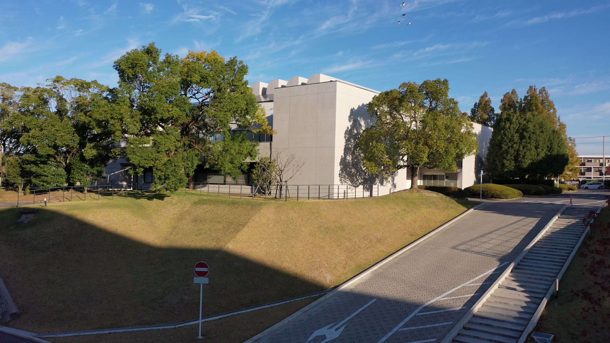

## <div align="center">Environment Setup</div>
```
conda env create -f environment.yml
conda activate MVA
```

## <div align="center">Inference a single image</div>
```
python sahi_detect.py --image_path <path/to/image>
```
## <div align="center">Sample Results</div>





---
### <div align="center">Citation</div>
```bibtex
@article{akyon2022sahi,
  title={Slicing Aided Hyper Inference and Fine-tuning for Small Object Detection},
  author={Akyon, Fatih Cagatay and Altinuc, Sinan Onur and Temizel, Alptekin},
  journal={2022 IEEE International Conference on Image Processing (ICIP)},
  doi={10.1109/ICIP46576.2022.9897990},
  pages={966-970},
  year={2022}
}
```
```bibtex
@software{obss2021sahi,
  author       = {Akyon, Fatih Cagatay and Cengiz, Cemil and Altinuc, Sinan Onur and Cavusoglu, Devrim and Sahin, Kadir and Eryuksel, Ogulcan},
  title        = {{SAHI: A lightweight vision library for performing large scale object detection and instance segmentation}},
  month        = nov,
  year         = 2021,
  publisher    = {Zenodo},
  doi          = {10.5281/zenodo.5718950},
  url          = {https://doi.org/10.5281/zenodo.5718950}
}
```